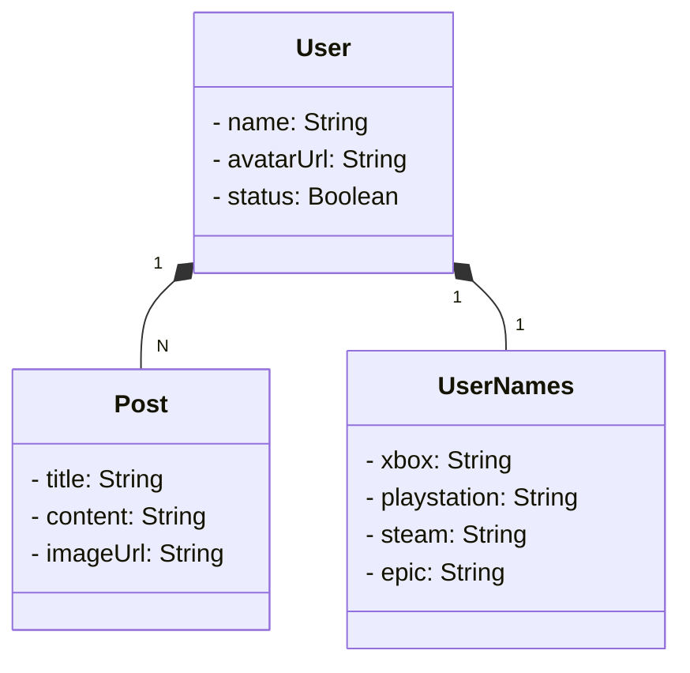

# dgama-project-ApiRest
Repositorio do Projeto de API RestFull
API para uma rede social voltada para gamers

## Diagrama de Classes do Projeto

```mermaid
classDiagram
  class User {
    - name: String
    - avatarUrl: String
    - status: Boolean
  }
  class Post {
    - title: String
    - content: String
    - imageUrl: String
  }
  class UserNames {
    - xbox: String
    - playstation: String
    - steam: String
    - epic: String
  }

  User"1" *-- "N"Post
  User"1" *-- "1"UserNames
```
